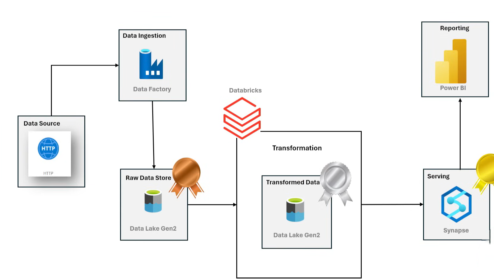
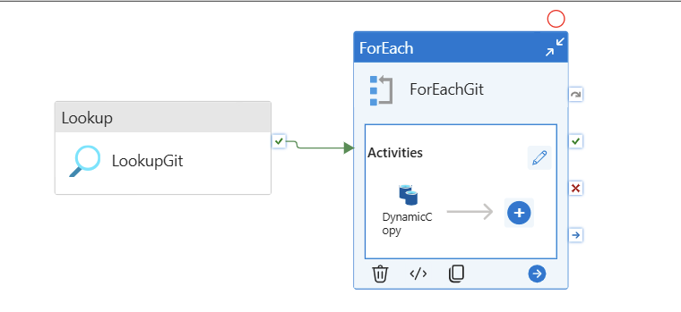
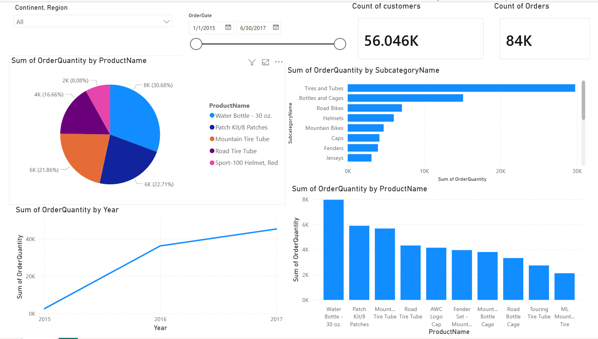

# 🚴 Adventure Works: End-to-End Azure Data Engineering Pipeline

[](https://azure.microsoft.com/)
[](https://spark.apache.org/)
[](https://databricks.com/)
[](https://powerbi.microsoft.com/)

## 📖 Introduction

This repository contains a comprehensive, production-grade enterprise data engineering solution built entirely on the **Microsoft Azure Cloud** ecosystem. The project implements a modern data pipeline utilizing a structured **Medallion Architecture (Bronze $\rightarrow$ Silver $\rightarrow$ Gold)** to process, transform, clean, and model raw operational data into actionable downstream business intelligence.

---

## 🏗️ Architecture Flow

```text
[ GitHub HTTP API ] 
        │
        ▼ (Ingestion via ADF)
┌────────────────────────────────────────────────────────┐
│             Azure Data Lake Storage Gen2               │
│                                                        │
│  📁 bronze/ (Raw CSV Data)                             │
│        │                                               │
│        ▼ (PySpark Cleaning & Normalization)            │
│  📁 silver/ (Optimized Parquet Format)                 │
│        │                                               │
│        ▼ (CETAS / Dimensional Modeling)                │
│  📁 gold/   (Enterprise Analytics Ready)               │
└────────────────────────────────────────────────────────┘
        │
        ▼ (Serverless SQL Pool Queries)
[ Azure Synapse Analytics ] ───▶ [ Power BI Dashboards ]

``` 

### 🏗️ 1. System Architecture Diagram

The end-to-end cloud infrastructure map detailing data movement through the Medallion layers via Azure Data Factory, Databricks, and Synapse Analytics.



### 🎯 Problem Statement

In modern enterprise data environments, transactional and operational source data is frequently fragmented across disparate locations (external HTTP APIs, static repositories, local files). The objective of this project is to overcome these hurdles by designing an automated cloud workflow capable of:

Dynamic Ingestion: Dynamically fetching raw data from external endpoints without hardcoding paths.

Scalable Transformation: Handling data quality and schemas efficiently at scale.

Structured Storage: Organizing analytical tables to enable low-latency, cross-departmental reporting.

### 🛠️ Technologies & Tools

Orchestration: Azure Data Factory (ADF) — Orchestrates dynamic, metadata-driven ETL pipelines utilizing lookups, parameters, and variable loops.

Storage (Data Lake): Azure Data Lake Storage (ADLS) Gen2 — Acts as the centralized storage backbone configured with hierarchical namespaces and fine-grained access control lists (ACLs).

Compute & Processing: Azure Databricks (Apache Spark / PySpark) — Provides cluster computing capabilities for heavy transformation, feature schema updates, and parallel computation.

Data Warehousing: Azure Synapse Analytics — Utilizes Serverless SQL pools to create external tables via OPENROWSET and CETAS for ad-hoc exploration and enterprise modeling.

Visualization: Power BI — Connects directly to analytical layers to compile data models into high-impact interactive dashboards.

Architectural Deep-Dive & Implementation

### 🥉 1. Data Ingestion (Bronze Layer)

Pipeline Dynamics: Built parameterized pipelines inside Azure Data Factory utilizing ForEach loop blocks and Lookup activities to scale asset extraction dynamically.

Ingestion Vector: Extracted multiple source datasets from the target repository via HTTP API connections, landing files safely into the bronze filesystem container as un-mutated raw CSVs.



### 🥈 2. Data Cleaning & Optimization (Silver Layer)

Compute Layer: Attached decoupled Azure Databricks Spark clusters via secure enterprise configurations targeting the global Azure endpoint storage mapping (.windows.net).

PySpark Transformations: Applied strict structural transformations including:

String replacement and pattern standardization via regex patterns (regexp_replace).

Date/Time parsing and casting (to_timestamp, month, year).

String composition and parsing (concat_ws, split).

Storage Optimization: Persisted highly optimized, columnar .parquet data splits back to the silver filesystem layer using .mode('append') logic.

### 🥇 3. Enterprise Analytics (Gold Layer)

Dimensional Modeling: Leveraged Azure Synapse Analytics serverless engines to query cleaned Parquet directories directly.

Decoupled Schema Structures: Built clean external metadata abstractions utilizing OPENROWSET methods and permanent analytical materializations via CETAS statements, making high-performance dimensions and fact tables queryable on demand.

### 📊 4. Business Intelligence Interface

Established explicit direct-line connection strings between Synapse SQL relational endpoints and Power BI Desktop to build reporting charts, ensuring live metrics mirror raw transactional records accurately.




### 🛡️ Security & Enterprise Integration

Secure Authentication: Managed cross-resource access using secure Entra ID (Azure AD) Service Principals and native Managed Identities rather than utilizing vulnerable hardcoded account keys.

Secret Management: Isolated sensitive platform metadata, Application IDs, and OAuth secret hashes securely inside Databricks using secret management scopes (dbutils.secrets).

### 📊 Key Outcomes

Dynamic Metadata Architecture: Upstream pipelines scale fluidly; adding new tabular parameters adjusts ingestion targets automatically without manual workflow intervention.

Data Quality Enforced: Resolved schema drifting and undefined variable bugs across dataframes, ensuring dependable runtime logic during batch runs.

Optimized Performance Realized: Migrating flat files down to structured Parquet formats reduced physical disk scan feet dramatically, driving down query compute costs.

### 📝 Conclusion

This project provides a robust, production-ready blueprint bridging the gap between raw web-hosted sources and operational dashboards. By adopting a decoupled Medallion Architecture and orchestrating unified services inside Microsoft Azure, this implementation delivers an agile data solution engineered to handle fluctuating enterprise workloads securely and efficiently.